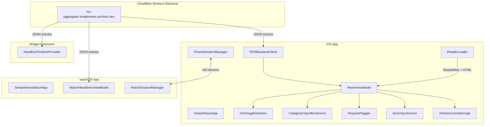
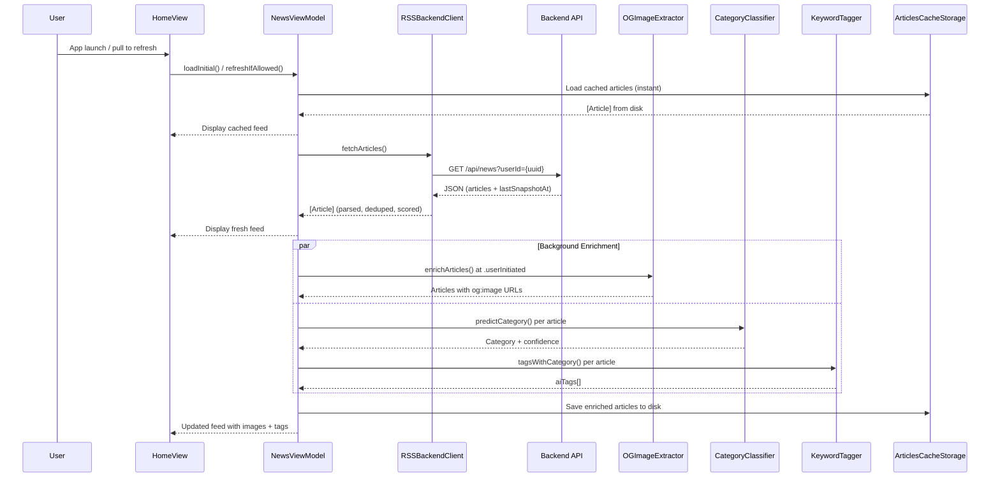
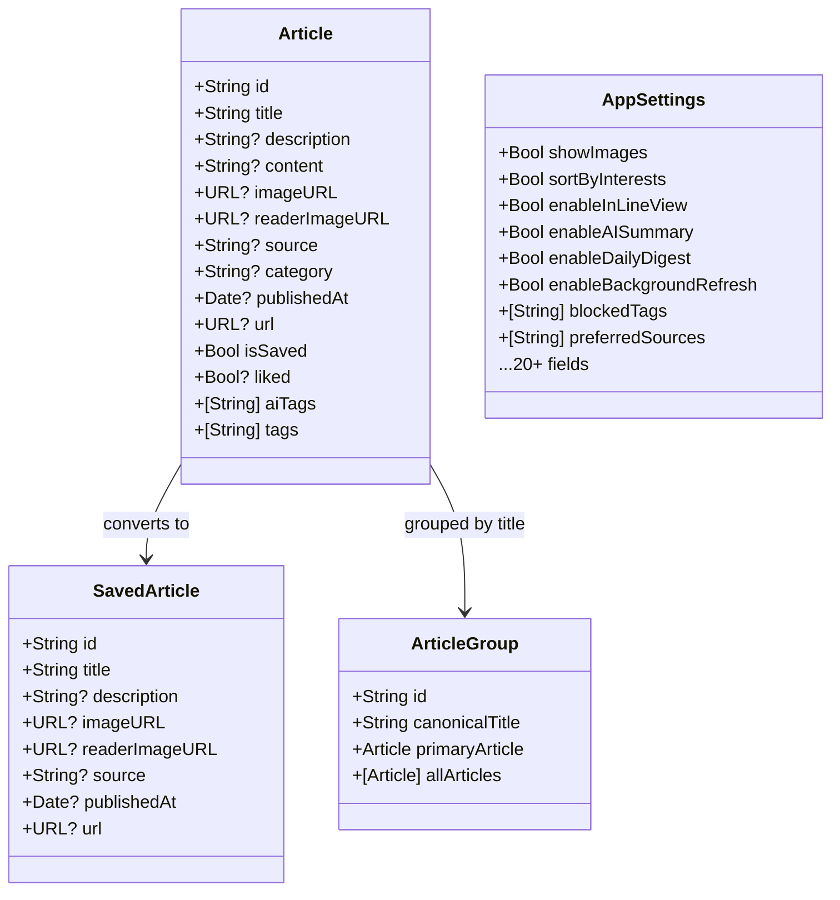
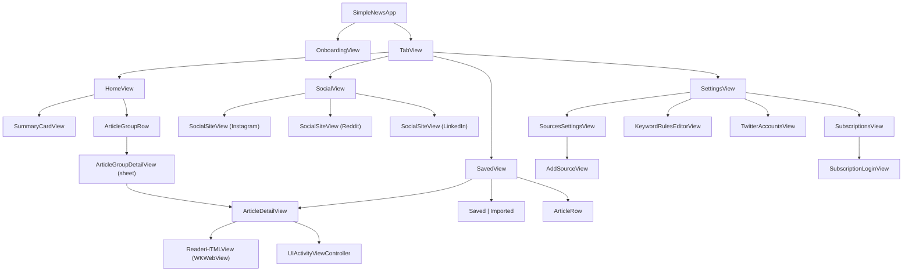
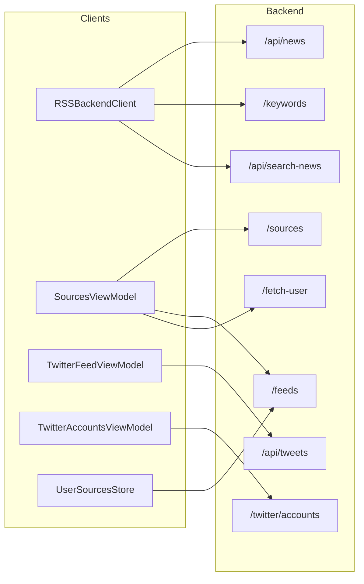
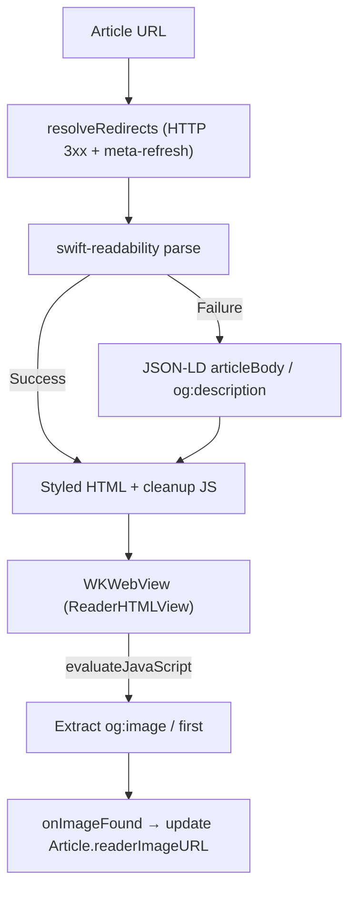
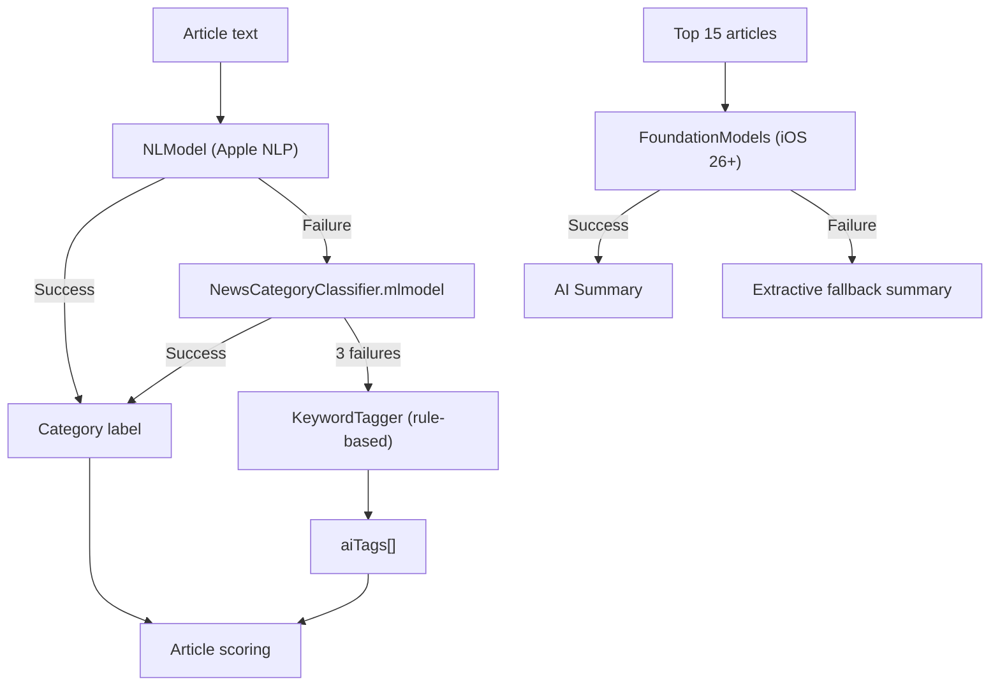
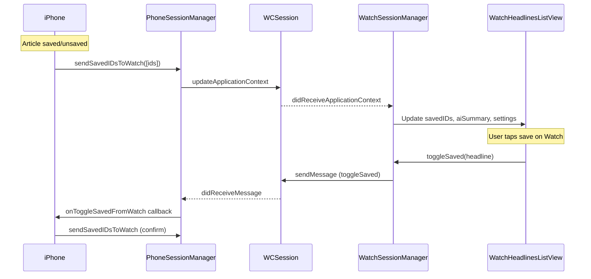
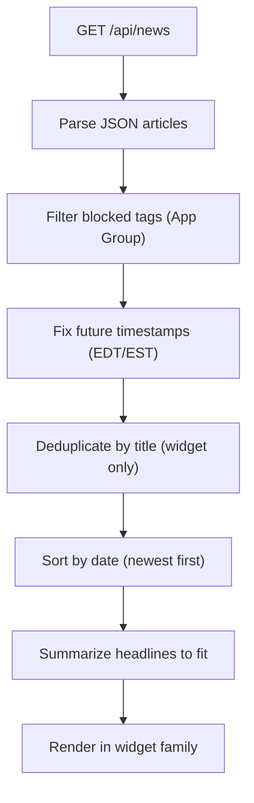
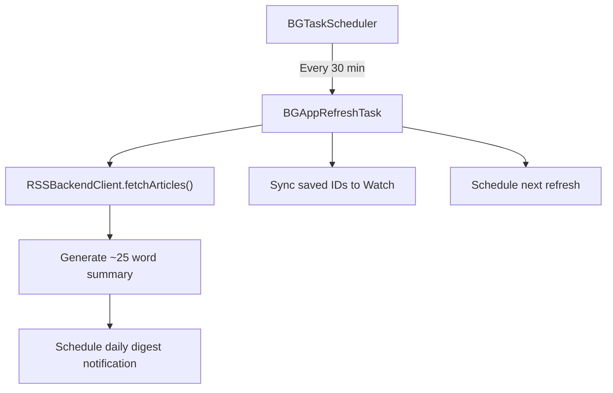

# SimpleNews Architecture

## Overview

SimpleNews is a multi-platform news aggregator built with SwiftUI. It fetches articles from a Cloudflare Workers backend that aggregates 20+ RSS feeds, enriches them with on-device ML classification, OG image extraction, and AI summarization, then presents them in a scored, grouped feed. The app spans four targets: iOS app, watchOS companion, home-screen widget, and watch complications.

---

## High-Level System Diagram



---

## Target Structure

| Target | Platform | Purpose |
|--------|----------|---------|
| `SimpleNews` | iOS 18+ | Main app with full feed, reader, settings, social |
| `SimpleNews Watch Watch App` | watchOS 11+ | Companion with headlines, save/unsave, AI summary |
| `SimpleNews Widget` | iOS 18+ | Home screen & lock screen headline widgets |
| `SimpleNewsComplication` | watchOS 11+ | Watch face complications |

---

## Data Flow

### Article Lifecycle



### Article Scoring

Every article receives a composite score that determines feed order:

```
score = 0.8 * recency + 0.5 * interest + preferredSourceBonus
```

| Component | Calculation |
|-----------|-------------|
| **Recency** | `1 / (1 + ln(1 + hours/3))` — logarithmic decay, tau = 3 hours |
| **Interest** | Sum of tag weights (from user likes/dislikes), normalized to [-1, 1] |
| **Source bonus** | +0.15 for user-designated preferred sources |

Articles are re-scored after the background tagging pass completes.

### Timestamp Correction

All four targets (iOS app, watchOS app, widget, complication) apply the same fix for feeds that mislabel EDT as EST:

- If a parsed date is in the future by <= 1 hour: shift back 1 hour
- If in the future by > 1 hour: clamp to `now`

This is implemented identically in `RSSBackendClient`, `WatchHeadlinesViewModel`, `HeadlineTimelineProvider`, and `SimpleNewsComplicationProvider`.

---

## Module Architecture

### Models



### Persistence

| Store | Backing | Key / Path | Purpose |
|-------|---------|------------|---------|
| `ArticlesCacheStorage` | File (Caches/) | `latest_articles.json` | Feed cache, max 200 articles, 7-day TTL |
| `SavedArticlesStorage` | UserDefaults | `savedArticles` | Bookmarked articles |
| `SettingsStorage` | UserDefaults | `appSettings` | All app preferences |
| `TagWeightsStorage` | UserDefaults | `tagWeights` | Interest weights `[String: Double]` |
| `ReadArticlesStore` | UserDefaults | `read_article_ids` | Set of read article IDs |
| `ImportedArticlesStore` | UserDefaults | `importedArticles` | Manually imported articles |
| `UserSourcesStore` | UserDefaults | `userFeedSources` | Enabled/disabled feed sources |
| `UserIdManager` | Keychain | `com.simplenews.userId` | Persistent device UUID |
| `UsageTracker` | UserDefaults | `usageTrackerDays` | Per-screen daily time tracking |
| `SubscriptionStore` | WKWebsiteDataStore | Per-domain cookie jars | Paywall login sessions |
| Blocked Tags (shared) | App Group UserDefaults | `group.com.simplenews.shared` → `blockedTags` | Widget/complication tag filtering |

---

## View Hierarchy



### Environment Objects

Injected at the app root and available throughout the view hierarchy:

| Object | Type | Purpose |
|--------|------|---------|
| `settingsStore` | `SettingsStore` | Read/write app preferences |
| `sourcesStore` | `UserSourcesStore` | Feed source enable/disable state |
| `importedStore` | `ImportedArticlesStore` | Manually imported articles |
| `usageTracker` | `UsageTracker` | Per-screen time tracking |
| `appState` | `AppState` | Deep link routing (daily digest, breaking news) |

---

## Networking Layer



All requests include either a `userId` query parameter or `X-SimpleNews-UserId` header for per-user feed personalization.

### Reader Pipeline



The cleanup JavaScript:
1. Hides media containers (`figure`, `video`, `iframe`, `nav`, `aside`)
2. Detects the first "real" paragraph (>= 100 chars, >= 8 spaces)
3. Hides everything before that paragraph (pre-article junk)
4. Scans all visible elements for known junk patterns and hides them (Advertisement, paywall prompts, copyright notices, Related Content, etc.)

---

## ML / AI Pipeline



| Component | Model | Fallback |
|-----------|-------|----------|
| **Category classification** | NLModel → CoreML (NewsCategoryClassifier) | KeywordTagger rules |
| **Tag extraction** | KeywordTagger (JSON rules, word-boundary matching) | None |
| **TF-IDF tagging** | NewsTagger.mlmodel (logistic regression, sigmoid > 0.15) | None |
| **Summarization** | FoundationModels (on-device, iOS 26+) | Extractive (first sentences) |

---

## Watch Integration



Communication uses `sendMessage` when reachable (instant) with `transferUserInfo` fallback (guaranteed delivery). Application context carries: saved IDs, AI summary text, user settings, and user ID.

---

## Widget & Complication Architecture

### Data Processing Pipeline

Both the widget and complication fetch articles from the same backend endpoint and apply a shared processing pipeline before display:



### Blocked Tag Sharing

The main app writes `blockedTags` to the shared App Group container (`group.com.simplenews.shared`) whenever settings are saved. The widget and complication read from this shared container to filter articles by category, keeping the feed consistent with the iOS app's Home view.

### Complication Family Layouts

| Family | Content | Character Budget |
|--------|---------|-----------------|
| `accessoryCorner` | Icon body + curved headline in `widgetLabel` | ~20 chars |
| `accessoryInline` | Single-line headline via `ViewThatFits` | ~35 chars |
| `accessoryRectangular` | Small header + prominent 2-line headline + small source | ~50 chars |

### Headline Condensation

Complication headlines are actively condensed rather than simply truncated. The `summarize` function applies these steps in order:

1. **Strip label prefixes** — Removes short text before a colon (e.g. "Elite longevity: Flacco..." → "Flacco...")
2. **Remove appositional clauses** — Strips inline asides like ", 41," or "(AP)"
3. **Collapse verbose phrasing** — Rewrites contract/trade language (e.g. "agrees to a 10-year $450 million contract with the Chiefs" → "agrees to deal"), removes filler like "sources say" and "according to ESPN"
4. **Clean up artifacts** — Removes double spaces, trailing punctuation, and stray quotes
5. **Word-boundary truncation** — If still over budget, cuts at the last space and appends an ellipsis

### Widget Deduplication

The iOS widget deduplicates articles by normalized (lowercased, trimmed) title before selecting the top 5 headlines. This prevents the same story from multiple sources appearing as separate entries.

---

## Background Processing



Registered task identifier: `com.simplenews.refresh`

Background modes declared in Info.plist: `fetch`

The refresh task is only scheduled when `settings.enableBackgroundRefresh` is true.

---

## Third-Party Dependencies

| Dependency | Version | Purpose |
|------------|---------|---------|
| [swift-readability](https://github.com/Ryu0118/swift-readability) | 0.3.0 | Extract article content from web pages |

All other functionality uses Apple frameworks: SwiftUI, WebKit, CoreML, NaturalLanguage, WatchConnectivity, BackgroundTasks, UserNotifications, Security.

---

## Key Architectural Decisions

1. **UserDefaults-heavy persistence**: Simple key-value storage for most state. File-based caching only for the article feed (which can be large). Keychain for the user ID.

2. **No Combine in business logic**: The codebase uses `async/await` throughout. `@Published` properties on `@MainActor` view models drive SwiftUI reactivity.

3. **Graceful degradation**: Every pipeline has fallbacks. Reader extraction falls back through Readability -> JSON-LD -> og:description. Classification falls back through NLModel -> CoreML -> keyword rules. Summarization falls back from Foundation Models to extractive.

4. **Image enrichment race condition handling**: `startBackgroundImageFetch` and `startBackgroundTagging` run concurrently. Both merge image URLs from the live array before writing back to prevent one from overwriting the other's results.

5. **Rate-limited refresh**: `refreshIfAllowed()` enforces a 10-minute cooldown between fetches unless explicitly overridden.

6. **Structured logging**: All diagnostic output uses `os.Logger` with categorized subsystems (network, data, ui, tagging, export, watch, notifications, background). Debug-level messages are excluded from on-disk logs in release builds.

7. **App Group for cross-target settings**: Blocked tags are synced from the main app to a shared App Group container (`group.com.simplenews.shared`) so the widget and complication can filter articles without duplicating the full settings stack. Only the minimal data needed (blocked tags array) is shared.

8. **Consistent timestamp correction**: The EDT/EST future-date fix is applied identically across all four targets to prevent feed ordering inconsistencies between the app, watch, widget, and complications.
